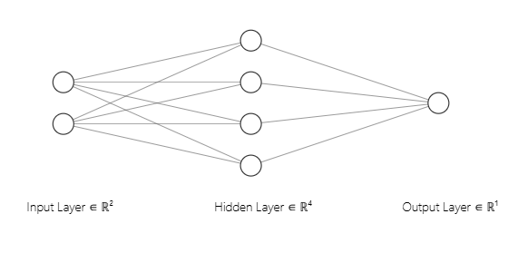
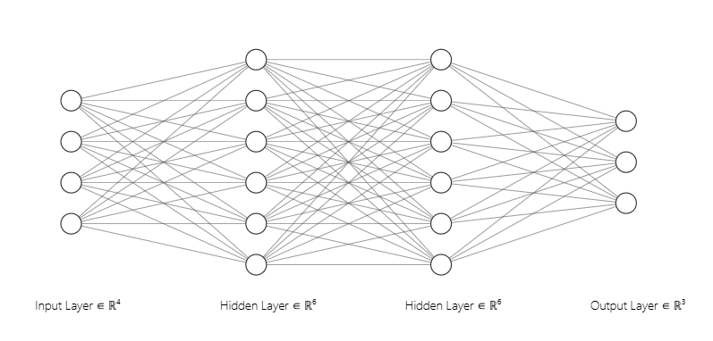

# SystemVerilog-Neural-Networks

Basic implementations of neural network architectures in SystemVerilog, featuring a layer-level pipeline for high-throughput inference. This project is ideal for studying and prototyping AI in hardware.

### ✨ Key Features

* **Pipelined Architecture:** A layer-by-layer pipeline design allows for continuous data processing, maximizing throughput.
* **Fixed-Point Quantization:** The networks utilize a **Signed Q3.4 (8-bit)** fixed-point representation, a crucial step for efficient hardware implementation.
* **Automatic Code Generation:** The example networks were generated by a custom tool that translates TensorFlow/Keras models into SystemVerilog.

---

## Implemented Architectures

### 🔹 `neuron_template_sigmoid.sv`

A template for a Perceptron-type neuron with a sigmoid activation function. It demonstrates the fundamental structure of a neuron, which can be adapted for other activation functions (like ReLU, used in the `Iris_net`).

---

### 🔹 `XOR_net`

A Multi-Layer Perceptron (MLP) example that solves the classic non-linearly separable XOR problem.

#### Topology

#### Implementation Details
* **Activation Functions:**
    * **Hidden Layer:** `Sigmoid`
    * **Output Layer:** `Sigmoid`
* **Quantization:** Signed Q3.4 (8-bit) fixed-point.
* **Post-Quantization Accuracy:** Achieved 100% classification accuracy. The final output values (e.g., ~0.9680 instead of 1.0) are not perfect, as this reflects the behavior of the original trained model. The quantization process faithfully preserved these floating-point results.
---

### 🔹 `Iris_net`

A neural network designed to classify samples from the classic Iris flower dataset.

#### Topology

#### Implementation Details

* **Activation Functions:**
    * **Hidden Layers:** `ReLU`
    * **Output Layer:** A hardware-optimized **Argmax unit** is used to find the winning class, replacing the computationally-expensive Softmax function from the training phase.
* **Quantization:** Signed Q3.4 (8-bit) fixed-point.
* **Post-Quantization Accuracy:** 97.33% (achieved with a specific training run).

---

### 📝 A Note on Code Generation

The neural network examples (`XOR_net` and `Iris_net`) were **automatically generated** by a custom tool. This tool converts a TensorFlow/Keras model into an equivalent, quantized SystemVerilog implementation using a base neuron template.

This repository focuses on the resulting SystemVerilog code. The generator tool itself is not part of this project.

### Acknowledgments

The neural network topology diagrams in this project were created using the excellent online tool [NN-SVG](https'//alexlenail.me/NN-SVG/) developed by Alex Lenail.
